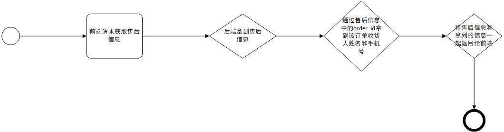

# 售后管理

## 获取售后信息

接口：（"/after_cares",get请求）

获取所有的售后信息，没有任何限制

流程图：

接口：（"/after_cares/{after_care_id}",get请求）

获取指定的售后信息，通过order_id获取收货手机号和姓名返回给前端

## after_care

| 名称               | 类型         | 备注       |
| ------------------ | ------------ | :--------- |
| id                 | INTEGER      | id主建     |
| except_type        | VARCHAR(30)  | 异常类型   |
| status             | INTEGER      | 服务状态   |
| create_time        | INTEGER      | 下单时间   |
| deliver_time       | INTEGER      | 退货时间   |
| recv_time          | INTEGER      | 收货时间   |
| close_time         | INTEGER      | 关闭时间   |
| order_id           | INTEGER      | 订单ID     |
| logistics_order_id | INTEGER      | 物流号     |
| logistics_id       | INTEGER      | 物流商家ID |
| business_id        | INTEGER      | 卖家id     |
| back_reason        | VARCHAR(400) | 退款原因   |
| remark             | VARCHAR(400) | 退款备注   |
| back_cost          | FLOAT        | 退款金额   |

## 各表状态汇总

| after_care | except_type | default: "退货退款"                   |
| ---------- | ----------- | ------------------------------------- |
| after_care | status      | 0: "待处理", 1: "已确定", 2: "已拒绝" |