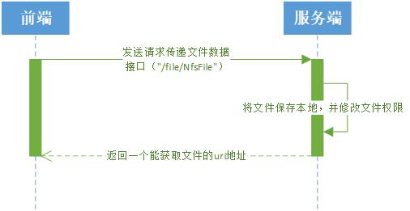
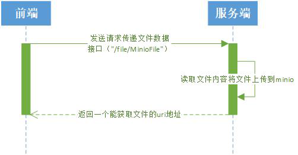
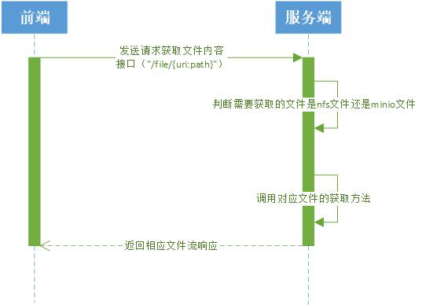
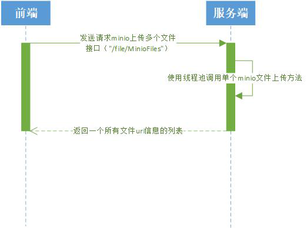

# file-文件管理

## nfs文件上传

时序图：

接口："/file/NfsFile" (post请求)

简介：

- 前端请求上传文件并传递文件数据
- 后端接收文件将文件保存在本地并修改文件权限
- 后端返回给前端一个能够通过后端接口拿到文件内容的uri地址

## minio文件上传

时序图：

接口："/file/MinioFile" (post请求)

简介：

- 前端请求上传文件并传递文件数据
- 后端接收文件将文件上传至minio
- 后端返回给前端一个能够通过后端接口拿到文件内容的uri地址

## 获取文件

时序图：

接口："/file/{uri:path}" (post请求)

简介：

- 前端请求获取文件内容
- 后端根据前端传递的路径判断是nfs文件还是minio文件
- 根据对应类型的文件调用对应文件的获取方法
- 拿到对应文件内容后通过文件流的形式传递给前端进行展示

## minio和nfs多文件上传

时序图（两者类似，以minio为例）：

接口："/file/MinioFiles" , "/file/NfsFiles" (post请求)

简介：

- 前端请求上传多个文件
- 后端通过线程池的方式调用单个文件上传的方法
- 上传完成后返回给前端包含所有已上传文件uri信息的列表