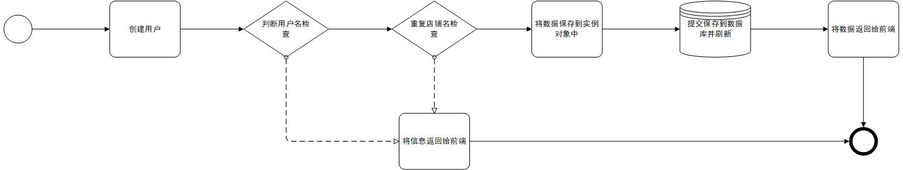
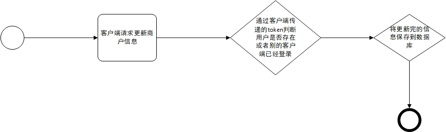
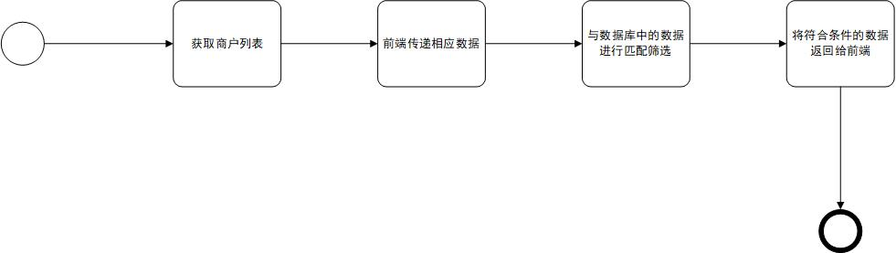

# 元宇宙商户管理

## 创建商户

基本流程：

接口："/user/create"（post 请求）

简介：

创建用户时会对前端传递过来的数据与数据库中的数据先进行匹配是否存在用户名和店铺名重复的如果存在的话就将提示信息返回给前端，如果没有问题会将数据添加到实例化对象中(在这个过程中会调用一个创建 token 的函数并添加到对象中)，最后提交事务并刷新数据库实例，然后将数据返回给前端。

## 商户登录

基本流程：

接口："/user/login"（post 请求)

简介：

登录用户时先在数据库查询用户名是否存在，检验密码时将普通密码和哈希密码传递给一个方法会返回相对于的布尔值。如果用户时第一次登录的话就可以直接成功登录，否则会查询用户对应的 occupied 字段(该字段值被 websocket 心跳维护)，如果字段值为 1 说明该账号已经在其他客户端登录所以在当前客户端无法登录并将信息返回给前端。登录成功的话会更新用户的 token 和上次 ping 前端的时间并将相应的数据返回给前端。

## websocket 链接

基本流程：

接口："user/ws"（websocket 请求）

简介：

浏览器登录成功后会和后端简历 websocket 连接，每个账户只能接受一个 websocket 请求。每当出现异常(浏览器发送 0 主动退出)修改 occupied 状态为 0，初次建立连接 occupied 状态为 1。

配置描述：

PING_INTERVAL: 后端主动 PING 前端的时间间隔。
LONG_EXPIRED: websocket 长时间未通判定为断开的时间。

## 更新商户信息

基本流程：

接口："/user/user"（put 请求）

简介：

更新商户信息前会对商户和客户端的 token 值进行检验，如果商户不存在和账户在其他客户端登录都会导致更新失败，只有检验通过才能对商户的信息进行修改。

## 获取商户列表

基本流程：

接口："user"（get 请求）

简介：

通过接受到前端传递过来的数据来在数据库中进行匹配和筛选，将拿到的数据转换为 json 数据返回给前端。

##

## 获取商户信息

接口："/user/getOnce/{item_id}" , "user/{token}/user_id"

简介：

获取商户信息有个接口，一个时通过用户的 id 在数据库中拿到商户的信息，另外一个时通过客户端的 token 值来拿到相应的用户 id。如果拿到的用户已经不存在或者 token 值过期和错误的话就会抛出相应的异常导致请求失败。
