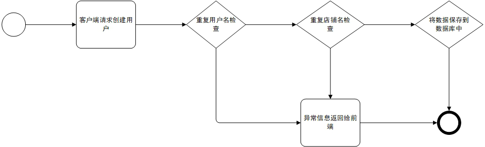

# 元宇宙商户管理

## 涉及的数据库表

### user
| 名称            | 类型           | 备注           |
|---------------|--------------|--------------|
| auth_token    | VARCHAR(255) | 登录token      |
| create_time   | INTEGER      | 创建时间         |
| id            | INTEGER      | id           |
| last_login    | INTEGER      | 最近时间         |
| password_hash | VARCHAR(255) | 加密后的登录密码     |
| status        | INTEGER      | 状态 0:正常 1:禁用 |
| storename     | VARCHAR(50)  | 店铺名称         |
| update_time   | INTEGER      | 更新时间         |
| name      | VARCHAR(255) | 用户名          |

## 创建商户

基本流程：

接口："/user/create"（post请求）

简介：

- 创建用户时会对前端传递过来的数据与数据库中的数据先进行匹配检查是否存在用户名和店铺名重复
- 如果存在的话就将异常信息返回前端。
- 如果没有问题会将数据添加到实例化对象中(在这个过程中会调用一个创建token的函数并添加到对象中)，最后提交事务并刷新数据库。

## 商户登录

基本流程：

接口："/user/login"（post请求)

简介：

- 登录用户时先在数据库查询用户名是否存在。
- 检验密码时将普通密码和哈希密码传递给一个方法会返回相对于的布尔值。
- 如果用户是第一次登录的话就可以直接成功登录。
- 否则会查询用户对应的occupied字段(该字段值被websocket心跳维护)，如果该字段值为1说明该账号已经在其他客户端登录所以在当前客户端无法登录并将信息返回给前端。
- 登录成功的话会更新用户的token和上次ping前端的时间并将相应的数据返回给前端。

## websocket链接

基本流程：

接口："user/ws"（websocket请求）

简介：

- 浏览器登录成功后会和后端简历websocket连接，每个账户只能接受一个websocket请求。
- 每当出现异常(浏览器发送0主动退出)修改occupied状态为0，初次建立连接occupied状态为1。

配置描述：

- PING_INTERVAL: 后端主动PING前端的时间间隔。
- LONG_EXPIRED: websocket长时间未通判定为断开的时间。

## 更新商户信息

基本流程：

接口："/user/user"（put请求）

简介：

- 更新商户信息前会对商户和客户端的token值进行检验。
- 如果商户不存在和账户在其他客户端登录都会导致更新失败。
- 只有检验通过才能对商户的信息进行修改。

## 获取商户列表

基本流程：

接口："user"（get请求）

简介：

- 通过接受到前端传递过来的数据来在数据库中进行匹配和筛选。
- 将拿到的数据转换为json数据返回给前端。

## 获取商户信息

接口："/user/getOnce/{item_id}"  ,   "user/{token}/user_id"

简介：

- 获取商户信息有两个接口。
- 一个是通过用户的id在数据库中拿到商户的信息返回给前端。
- 另外一个时通过客户端的token值来拿到相应的用户id。如果拿到的用户已经不存在或者token值过期和错误的话就会抛出相应的异常导致请求失败，成功则将拿到的user_id返回给前端。

## 商户登录接口(/user/swagger/login)

### 输入创建用户的信息

### 返回的响应

### 输入用户名和密码进行登录

### 成功登录

### web页面进行登录（页面调用的是"/user/login"接口）

### 成功登录

