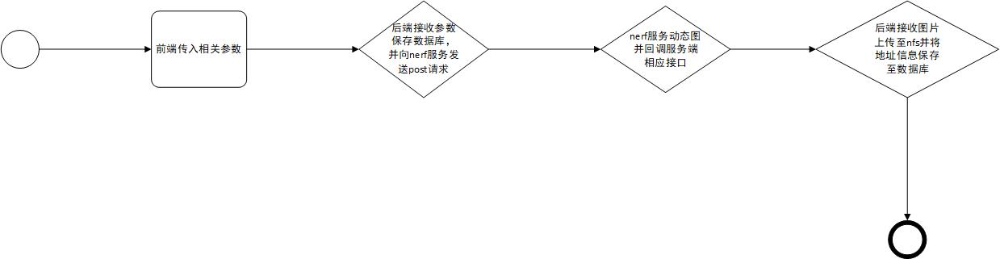
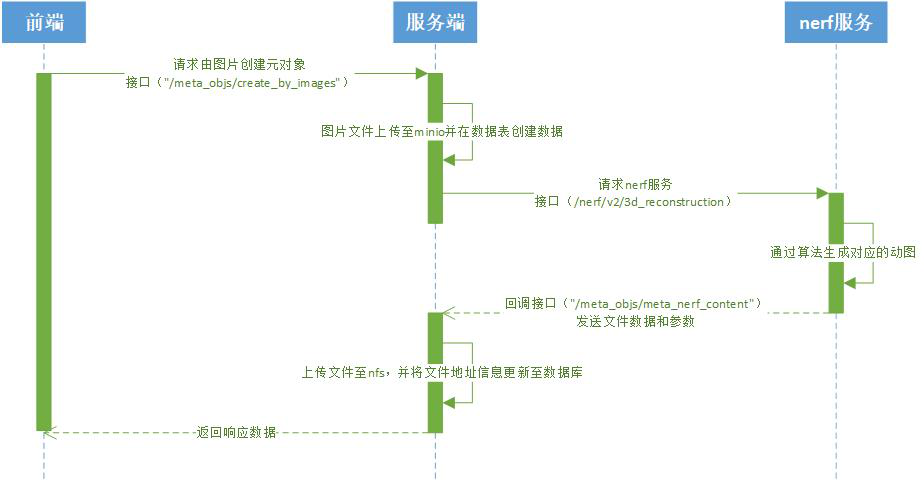

# 多个图片渲染动图

## 涉及的数据库表

## meta_obj
| 名称            | 类型           | 备注       |
|:--------------|--------------|:---------|
| id    | INTEGER | id  |
| name   | VARCHAR(255) | 名称     |
| type   | INTEGER | 类型 0: upload 1: image 2: video |
| kind | INTEGER      | 种类 0:场景素材 1:商品 |
| aigc | VARCHAR(999999) | aigc源地址 |
| status | INTEGER      | 商品状态 0:渲染中 1:已完成 2:渲染失败 |
| model | VARCHAR(255) | 模型文件地址 |
| thumbnail | VARCHAR(255) | 缩略图地址 |
| tag | VARCHAR(255) | 物品种类 |
| create_time | Integer | 创建时间 |
| creator_id | Integer | 创建者id |
| height | Float | 物品高度 |

## 流程介绍

基本流程：

时序图：

涉及接口：

- 商户端接口："/meta_objs/create_by_images"（post请求） , "/meta_objs/meta_nerf_content"（post请求）
- ai服务接口："/nerf/v2/3d_reconstruction"（post请求)

简介：

- 前端接收相关参数对"/meta_objs/create_by_images"发送post请求
- 后端接收参数保存数据到数据库并对ai服务的"/nerf/v2/3d_reconstruction"发送post请求
- ai服务接收参数将多张图片渲染成一张动图并向"/meta_objs/meta_nerf_content"发送post请求
- 后端接收参数后将动图上传保存至nfs并将文件地址信息和状态保存至数据库