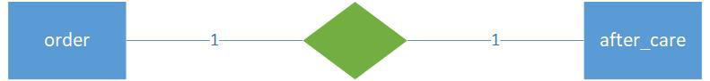
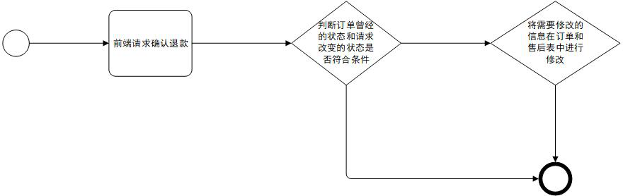

# 商户端订单管理

## 获取订单信息

接口（"/orders",get请求）

获取系统所有的订单信息（没有任何限制）

接口（"/orders/{order_id}",get请求）

获取指定的订单信息

## 确认退款

涉及ER实体关系图：

流程图：

判断订单之前的状态和需要修改的状态：

- 先用一个变量拿到之前的订单状态
- 再将前端传递过来的状态参数修改到数据对象中
- 判断之前的状态是申请售后("-1"),请求传递过来的状态是同意退货退款("3")
- 后续将需要修改的信息进行修改并保存至数据库

## 涉及数据表

## order

| 名称              | 类型          | 备注             |
| ----------------- | ------------- | :--------------- |
| id                | INTEGER       | id主建           |
| status            | INTEGER       | 订单状态         |
| create_time       | INTEGER       | 创建时间         |
| deliver_time      | INTEGER       | 发货时间         |
| recv_time         | INTEGER       | 收货时间         |
| close_time        | INTEGER       | 结束时间         |
| pay_count         | Float         | 支付金额         |
| after_care_id     | INTEGER       | 退货id           |
| business_id       | INTEGER       | 商家ID           |
| customer_id       | INTEGER       | 买家ID           |
| receiver_phone    | VARCHAR(12)   | 收货电话         |
| deliver_address   | VARCHAR(150)  | 发货地址         |
| logistic_id       | INTEGER       | 物流商id         |
| logistic_name     | VARCHAR(15)   | 物流商名称       |
| back_reason       | VARCHAR(400)  | 退款原因         |
| logistic_order_id | VARCHAR(30)   | 物流商快递物流ID |
| receiver_address  | VARCHAR(300)  | 收货地址         |
| receiver_name     | VARCHAR(30)   | 收货人姓名       |
| postal_code       | VARCHAR(10)   | 邮编             |
| order_number      | VARCHAR(30)   | 订单编号         |
| sku_id            | INTEGER       | 库存id           |
| num               | INTEGER       | 购买数量         |
| sku_snapshot      | VARCHAR(2000) | sku快照          |

## after_care

| 名称               | 类型         | 备注       |
| ------------------ | ------------ | :--------- |
| id                 | INTEGER      | id主建     |
| except_type        | VARCHAR(30)  | 异常类型   |
| status             | INTEGER      | 服务状态   |
| create_time        | INTEGER      | 下单时间   |
| deliver_time       | INTEGER      | 退货时间   |
| recv_time          | INTEGER      | 收货时间   |
| close_time         | INTEGER      | 关闭时间   |
| order_id           | INTEGER      | 订单ID     |
| logistics_order_id | INTEGER      | 物流号     |
| logistics_id       | INTEGER      | 物流商家ID |
| business_id        | INTEGER      | 卖家id     |
| back_reason        | VARCHAR(400) | 退款原因   |
| remark             | VARCHAR(400) | 退款备注   |
| back_cost          | FLOAT        | 退款金额   |

## 各表状态汇总

| order      | status      | 0: "待发货", 1: "待收货", 2: "已完成", 3: "已完成(同意退货退款)", 4: "已完成(拒绝退货退款)"，-1: "售后中" |
| ---------- | ----------- | ------------------------------------------------------------ |
| after_care | except_type | default: "退货退款"                                          |
| after_care | status      | 0: "待处理", 1: "已确定", 2: "已拒绝"                        |
