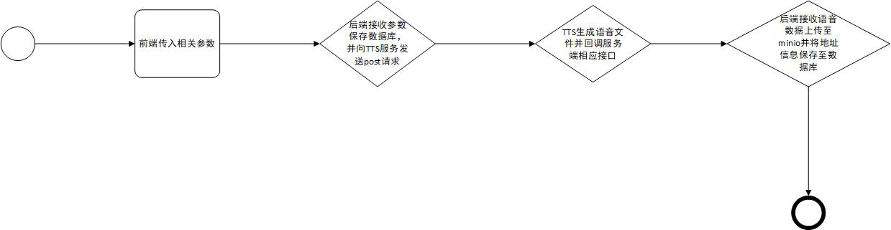

# 文字转语音

## 涉及的数据库表

## marketing_content
| 名称            | 类型           | 备注       |
|:--------------|--------------|:---------|
| id    | INTEGER | id  |
| name   | VARCHAR(20) | 名称     |
| content       | VARCHAR(10000) | 内容       |
| metaobj_id | INTEGER      | 关联的metaobj_id |
| creator_id | INTEGER | 创建者id |
| virtual_human_id | INTEGER      | 关联的虚拟人id |
| create_time | INTEGER | 创建时间 |
| status | Integer | 状态 1、2:音频生成中、已生成  3、4:视频生成中、已生成 |
| audio_uri | VARCHAR(50) | 音频地址 |
| video_uri | VARCHAR(50) | 视频地址 |
| work_space | VARCHAR(50) | 命名空间 |

## 流程介绍

基本流程：

涉及接口：

- 商户端接口："/marketing_contents/marketing_content"（post请求） , "/marketing_contents/market_minio_content"（post请求）
- ai服务接口："/tts/v2"（post请求）

简介：

- 前端接收相关参数对"/marketing_contents/marketing_content"发送post请求
- 后端接收参数保存数据到数据库并对ai服务的"/tts/v2"发送post请求
- ai服务接收参数将文字内容转换成语音文件并向"/marketing_contents/market_minio_content"发送post请求
- 后端接收参数后将语音数据上传保存至minio并将文件地址信息和状态保存至数据库